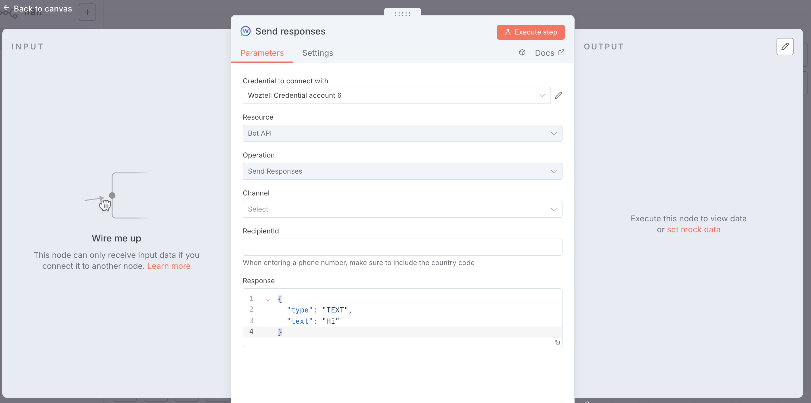
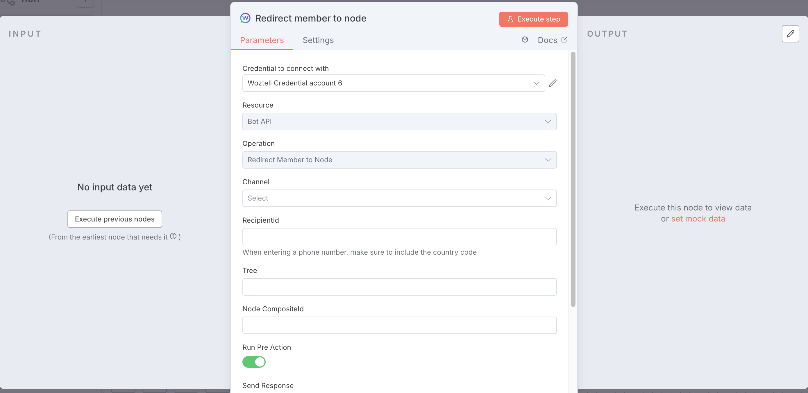
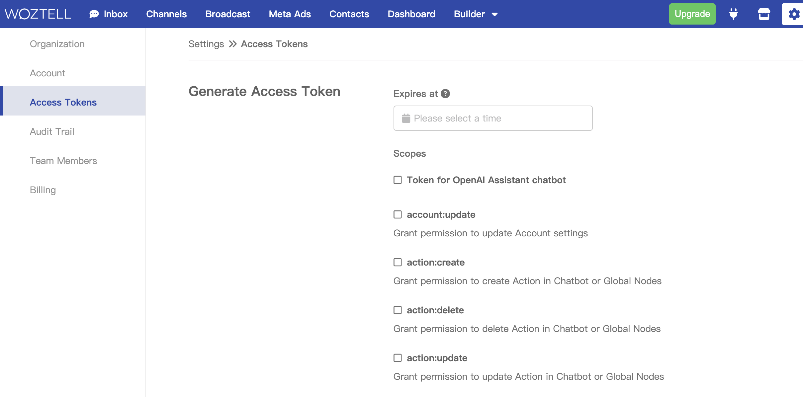
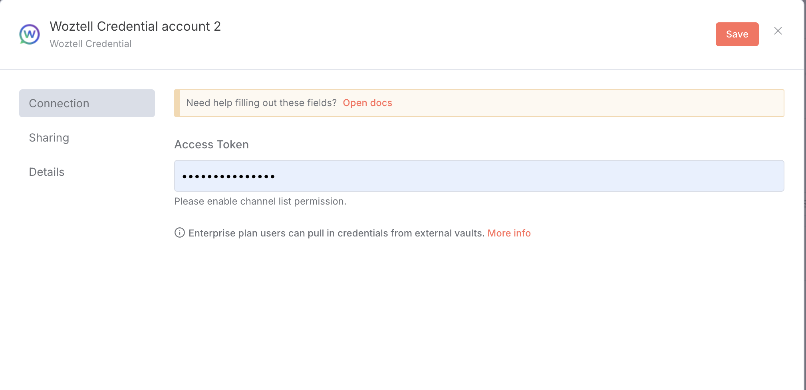

# n8n-nodes-woztell-sanuker

For easier [Woztell](https://woztell.com/) integration within your n8n workflows.

[Installation](#installation)  
[Operations](#operations)  
[Credentials](#credentials)  
[Resources](#resources)  

## Installation

Install [the community node package in your n8n instance](https://docs.n8n.io/integrations/community-nodes/installation/gui-install/):

```
@woztell/n8n-nodes-woztell-sanuker
```

## Operations

You can use the Trigger node to listen for webhook requests.  
The Send Response node allows you to send messages to specific users.  
If you've configured a chatbot in Woztell, the Redirect Member to Node can direct users to a chatbot node.  




## Credentials

1. Open the [link](https://platform.woztell.com/settings/accesstokens?lang=en) and enable the `channel:list`, `botapi:sendResponses`, and `bot:redirectMemberToNode` permissions.
2. Generate the access token.

For more details, please refer to this [link](https://doc.woztell.com/docs/documentations/settings/access-token).




## Resources

- [n8n community nodes documentation](https://docs.n8n.io/integrations/#community-nodes)
- _Link to app/service documentation._
